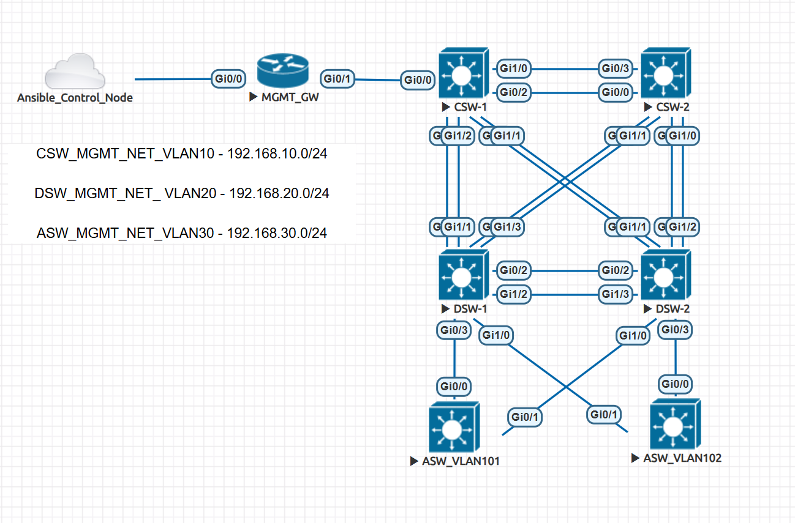

# Cisco IOS Day-1 Provisioning with Ansible

Automated day-1 configuration provisioning for Cisco IOS switches using Ansible. This project automates the initial deployment and standardization of switch configurations across a three-tier network topology.



## Overview

This playbook is designed for **day-1 provisioning** of new Cisco IOS switches, automating the initial configuration tasks that would otherwise need to be performed manually on each device.

### What Gets Configured

- Hostname assignment
- AAA model with TACACS+ authentication
- Local user accounts (fallback)
- Login and MOTD banners
- VLAN database creation
- Access port configuration
- NTP synchronization
- SNMP v3 monitoring
- Configuration backup generation

## Prerequisites

### Control Node

- **OS**: Ubuntu 22.04.5 (or similar Linux distribution)
- **Ansible**: Community version 10.7.0
- **Cisco IOS Collection**: `cisco.ios` 11.4.1

### SSH Legacy Crypto Configuration

The EVE-NG IOS images (viosl2-adventerprisek9-m) use legacy SSH algorithms. Configure your control node's SSH client by editing `/etc/ssh/ssh_config`:

Add these lines:
```
KexAlgorithms diffie-hellman-group1-sha1,curve25519-sha256@libssh.org,ecdh-sha2-nistp256,ecdh-sha2-nistp384,ecdh-sha2-nistp521,diffie-hellman-group-exchange-sha256,diffie-hellman-group14-sha1
HostKeyAlgorithms +ssh-rsa
HashKnownHosts no
```

### Network Connectivity

Ensure your control node can reach the management IPs of all switches:

- **Core Switches (CSW)**: 192.168.10.x (VLAN 10)
- **Distribution Switches (DSW)**: 192.168.20.x (VLAN 20)
- **Access Switches (ASW)**: 192.168.30.x (VLAN 30)

## Network Topology

The project follows a hierarchical three-tier design with Core, Distribution, and Access layers. Refer to `topology.png` for the detailed network diagram.

## Inventory Structure

```
inventory/
├── hosts.ini              # Host definitions and connection settings
├── group_vars/
│   ├── all.yml            # Variables applied to ALL switches
│   ├── core_switches.yml  # Core-specific overrides
│   ├── dist_switches.yml  # Distribution-specific overrides
│   └── access_switches.yml # Access-specific overrides
└── host_vars/
    ├── CSW-1.yml, CSW-2.yml
    ├── DSW-1.yml, DSW-2.yml
    └── ASW-1.yml, ASW-2.yml
```

Variable inheritance order (last one wins):
1. `group_vars/all.yml`
2. `group_vars/{group}.yml`
3. `host_vars/{hostname}.yml`

## Day-1 Configuration Details

### Hostname Configuration
Sets the system hostname from `ansible_hostname` in `hosts.ini`.

### AAA and Authentication
Configures centralized authentication with local fallback:

- AAA new-model enables the AAA authentication framework
- Enable secret sets privileged exec password
- Local user creates admin account with privilege level 15
- TACACS+ servers with primary/secondary configuration
- TACACS+ groups for failover
- AAA commands for authentication, authorization, and accounting

### Banners
- **Login banner**: Warning about production environment and change control
- **MOTD banner**: Unauthorized access prohibition notice

Banner templates are in `playbooks/banner_sms/` (login.cfg and motd.cfg).

### VLAN Database
Default VLANs (from `group_vars/all.yml`):

| VLAN ID | Name    | Purpose          |
|---------|---------|------------------|
| 101     | HR      | HR Department    |
| 102     | CCTV    | Security Cameras |
| 103     | PRINTER | Printers         |

### Access Interfaces
Configures access ports on switches with `access_interfaces` defined in host_vars. Default configuration includes switchport mode access, nonegotiate, CDP disabled, and shutdown (for day-1 safety).

### NTP Synchronization
Configures switches with primary/secondary NTP servers. Source interface is set per-group (VLAN 10/20/30 for core/dist/access respectively).

### SNMP v3 Monitoring
Configures SNMP v3 for secure monitoring including views, groups, and trap/inform receivers. Source interface is set per-group.

### Configuration Backup
Saves running-config to startup-config and creates timestamped backups in `config_bkp/{hostname}/`.

## Running the Playbook

### Full Day-1 Provisioning
```bash
ansible-playbook -i inventory/hosts.ini playbooks/main.yml
```

### Tag-Based Execution
Run specific tasks: `--tags <tag>`

Available tags: `ping`, `hostname`, `aaa`, `banner`, `vlan`, `access_interfaces`, `ntp`, `snmp`, `backup`

Example:
```bash
ansible-playbook -i inventory/hosts.ini playbooks/main.yml --tags vlan
```

### Limiting to Groups or Hosts
```bash
# Only core switches
ansible-playbook -i inventory/hosts.ini playbooks/main.yml --limit core_switches

# Single switch
ansible-playbook -i inventory/hosts.ini playbooks/main.yml --limit CSW-1
```

## Customization

### Switch Credentials
Edit `inventory/hosts.ini` to update credentials. For production, use Ansible Vault to encrypt passwords.

### Adding New Switches
1. Add switch to appropriate group in `inventory/hosts.ini`
2. Create `inventory/host_vars/{hostname}.yml` with host-specific configurations

### Adding VLANs
Edit `inventory/group_vars/all.yml` to add new VLANs to the `vlans` list.

### Modifying TACACS+
Edit `tacacs_svr` and `tacacs_svr_group` in `inventory/group_vars/all.yml`.

### Modifying NTP/SNMP
Edit `ntp_servers` and `snmp_hosts` in `inventory/group_vars/all.yml`.

## Troubleshooting

### Ping Test Fails
Verify switch IP, network connectivity, and no firewall blocking ICMP.

### SSH Connection Issues
1. Verify SSH legacy crypto is configured
2. Test manual SSH connection
3. Check `ansible_network_os` is set to `cisco.ios.ios`

### AAA Configuration Fails
Check TACACS+ server IPs and keys, ensure server reachability.

### VLAN Creation Fails
Verify VLAN ID is valid (1-4094), check VTP mode allows VLAN creation.

### Backup Verification
Backups are stored in `config_bkp/{hostname}/` with timestamp format.
